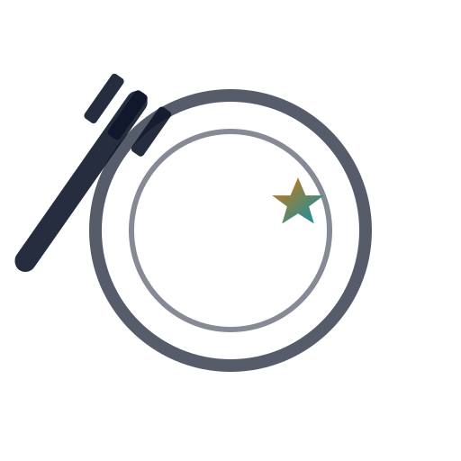

  

# 👋 Hi, there.  

I’m building **[FoodRatings](https://github.com/msjammu/FoodRating)** — an app to rate food places (restaurants, canteens, hotels, etc.) and provide insights to owners and staff.  

But more than just the app, this is my **“Learn in Public” journey**. I’m using this project to explore **state-of-the-art technologies** and share everything I learn along the way.  

---

## 🚀 What I’m Working On  
- **FoodRatings App** — feedback system + staff training + business insights.  
- **Blogging my journey** (see [docs](https://github.com/msjammu/FoodRating/tree/main/docs)).  
- Experimenting with the latest stack:  
  - ⚡ Next.js 14 + React Server Components  
  - 🎨 TailwindCSS + shadcn/ui  
  - 🗄️ Supabase / Neon (Postgres with row-level security)  
  - 🤖 GPT-5 for AI-powered insights  
  - ☁️ Serverless functions + GitHub Actions  
  - 📊 PostHog + OpenTelemetry for analytics  

---

## 📚 Learn With Me  
I’ll be sharing my progress in:  
- Blog posts inside the repo (markdown).  
- Issues & discussions as “thinking out loud.” 
- Commit history — every experiment is part of the journey.  

💡 *My goal: not just to build an app, but to build a resource for anyone learning modern full-stack dev.*  

---

## 📖 Blog
- [Building FoodRatings with State-of-the-Art Tech](docs/blog/first-post.md)
- [FoodRatings Market Research Report](docs/blog/market-research.md)

## 🌟 Let’s Connect  
- 🖥️ Follow the repo: [FoodRatings](https://github.com/msjammu/FoodRating)  
- 💬 Open an issue to share ideas, feedback, or collab.  
- 🔗 I’ll share blog updates on GitHub and LinkedIn (coming soon).  

---

## ⚡ Tech Badges  
  
  
  
  
  
  

---

✨ Thanks for stopping by! I’m just getting started — follow along if you want to see how **FoodRatings** (and my skills) grow over time.  
